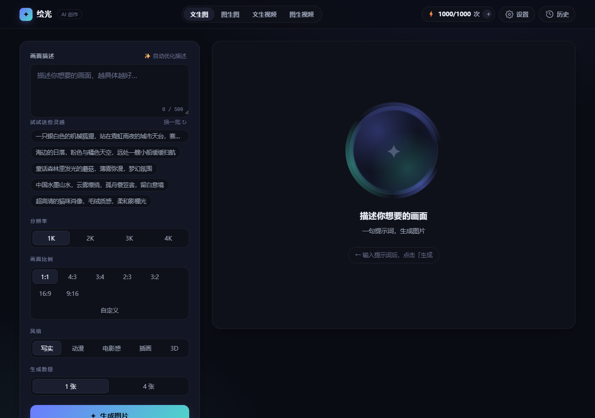

# 绘光 Halo · AI Image & Video Studio

> A zero-dependency, multi-language AI creation app — text-to-image, image-to-image, text-to-video, image-to-video.
> Powered by Agnes AI with offline fallback engine.

<p align="center">
  
</p>

<div align="center">

[中文](README_zh.md) · [English](README_en.md) · [日本語](README_ja.md) · [한국어](README_ko.md) · [Español](README_es.md) · [Français](README_fr.md) · [Deutsch](README_de.md) · [Português](README_pt-BR.md)

</div>

---

## 简介

基于 Agnes AI 的四模式创作应用。输入一句提示词，或加上传参图片，即可生成图片和短视频，可下载、有历史记录、支持配额管理。零依赖、可直接双击打开，也可启动 Node 服务器获得完整的 API 同源代理能力。

## 快速开始

```bash
git clone https://github.com/bitini111/imvedio.git
cd imvedio
node server.js
# 访问 http://localhost:8653
```

也可直接双击 `index.html` 打开（浏览器直连 Agnes，可能遇 CORS 限制）。

## 技术栈

- 纯原生 HTML / CSS / JavaScript，无任何第三方依赖，无需构建
- 视频编码使用浏览器原生 `MediaRecorder` + `captureStream`
- 历史记录使用 IndexedDB，配额使用 localStorage
- Node.js 服务器提供静态文件服务 + Agnes API 同源代理

## 对接的 Agnes AI 接口

| 用途 | 模型 | 接口 |
|---|---|---|
| 文本 / 描述优化 | `agnes-2.5-flash` | `POST /v1/chat/completions` |
| 文生图 / 图生图 | `agnes-image-2.5-flash` | `POST /v1/images/generations` |
| 文生视频 / 图生视频 | `agnes-video-2.5-flash` 或 `agnes-video-v2.0` | `POST /v1/videos` |

---

## 🌏 中文
[查看详细文档 →](README_zh.md)

## 🌍 English
[Read full documentation →](README_en.md)

## 🇯🇵 日本語
[詳細ドキュメント →](README_ja.md)

## 🇰🇷 한국어
[문서 보기 →](README_ko.md)

## 🇪🇸 Español
[Ver documentación →](README_es.md)

## 🇫🇷 Français
[Voir la documentation →](README_fr.md)

## 🇩🇪 Deutsch
[Dokumentation anzeigen →](README_de.md)

## 🇧🇷 Português
[Vers documentação →](README_pt-BR.md)

---

**License: MIT** | Author: bitini111
